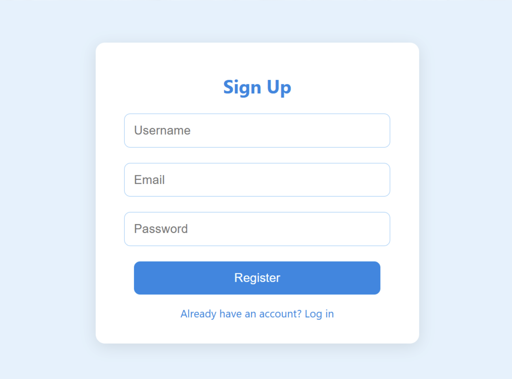
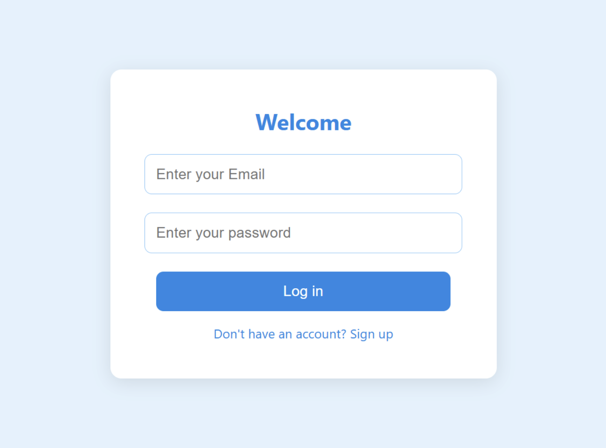
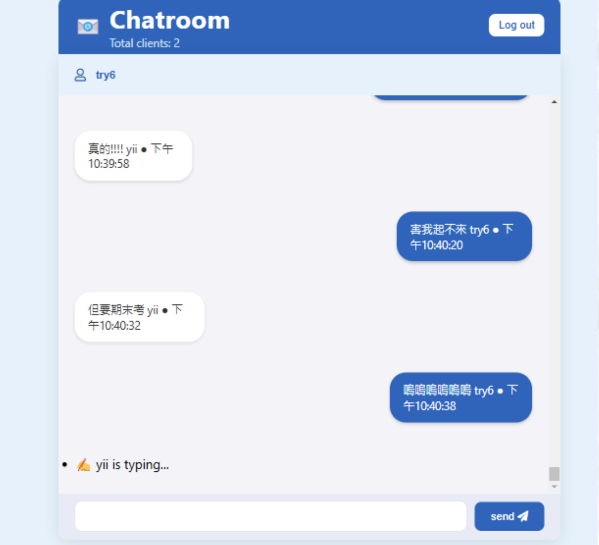

# Online Chatroom System

This project is a real-time online chatroom system which enables instant communication between users with persistent chat history.

## Features

- **User Registration**  
  Users can register via a form. Data is sent to the backend with a `POST /api/register` request. User information is stored in MongoDB Cloud Database.

- **User Login**  
  Backend is exposed using Ngrok for public access. Users log in via a `POST /api/login` request. Server validates credentials and returns user info.

- **Real-time Messaging**  
  Messages are sent via WebSocket (socket.io). New messages instantly appear in the chat UI. Both sending and receiving are displayed in real time.

- **Online Users Count**  
  Server tracks and broadcasts the number of connected users. Updated dynamically when users join or leave.

- **User Join/Leave Notifications**  
  When a user disconnects, all other users are notified. Example: "User X left the chat room."

- **Typing Indicator**  
  Shows "User is typing..." when someone is entering a message. Implemented with socket events (`keypress`, `blur`, `feedback`).

- **Persistent Chat History**  
  Messages are stored in MongoDB for history tracking.

## Tech Stack

- Node.js – Runtime environment  
- Express – Backend HTTP server framework  
- WebSocket (Socket.IO) – Real-time bidirectional communication  
- MongoDB (Cloud) – Database for user data and chat history  
- Ngrok – Public tunneling service for local server testing  

## Setup Instructions

1. Download and install Node.js, socket.io, and ngrok.  
2. In the project folder terminal, start the server:  
`node server.js`
3. In another terminal window, start the tunnel:
`ngrok http 3000`
4. Copy the generated ngrok URL and paste it into login.html at line 43:
const apiBaseURL = 'https://fbdd-118-171-131-243.ngrok-free.app';Replace with your actual Ngrok URL 
5. Open the ngrok URL in a browser to access the system.

## Demo Screenshots

- **Sign Up Page**  
  

- **Login Page**  
  

- **Chatroom Page**  
  

This chatroom system was developed as a project for the course MIS303 - Bussiness Data Communcation & Networking.
